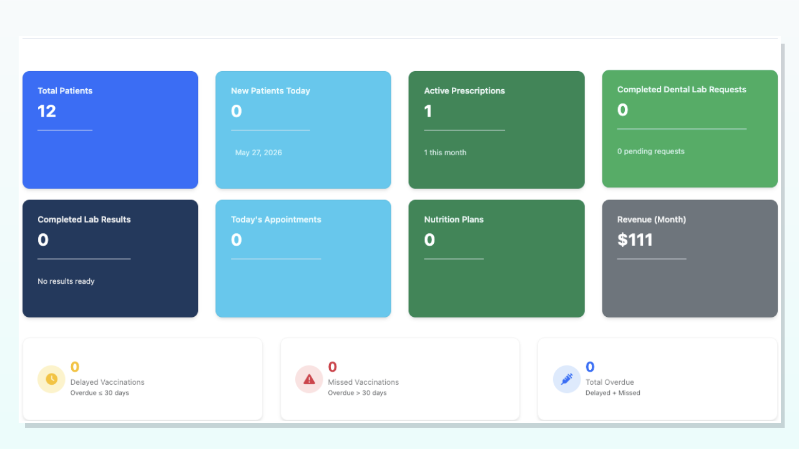
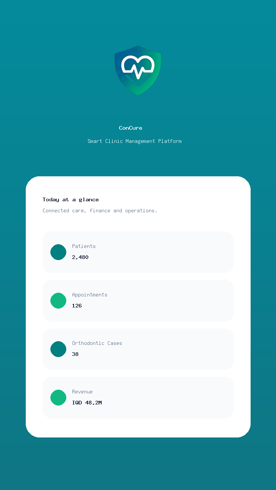

# 🚀 ConCure Cloud - Localhost Installation Guide

This guide will help you install and run the ConCure Clinic Management System on your localhost for testing and development.

---

## 📋 Prerequisites

Before you begin, ensure you have the following installed on your computer:

### Required Software
- **PHP** 8.1 or higher ([Download](https://www.php.net/downloads))
- **Composer** - PHP dependency manager ([Download](https://getcomposer.org/download/))
- **MySQL** or **MariaDB** database server ([Download MySQL](https://dev.mysql.com/downloads/) or use XAMPP/MAMP)
- **Node.js** 16.0 or higher (optional, for frontend assets) ([Download](https://nodejs.org/))

### System Requirements
- **OS**: Windows 10+, macOS 10.14+, or Linux
- **RAM**: 4GB minimum, 8GB recommended
- **Storage**: 2GB free space
- **Browser**: Chrome, Firefox, Safari, or Edge (latest version)

---

## 🛠️ Installation Steps

### Step 1: Download the Project

Clone or download the ConCure Cloud project to your local machine:

```bash
# Using Git
git clone https://github.com/Ehab-coder-apple/ConCure-Cloud.git
cd "Concure Cloud"

# Or download and extract the ZIP file
```

### Step 2: Install PHP Dependencies

```bash
# Navigate to the project directory
cd "Concure Cloud"

# Install Composer dependencies
composer install
```

### Step 3: Configure Environment

```bash
# Copy the example environment file
cp .env.example .env

# Generate application key
php artisan key:generate
```

### Step 4: Configure Database

Open the `.env` file and update the database settings:

```env
DB_CONNECTION=mysql
DB_HOST=127.0.0.1
DB_PORT=3306
DB_DATABASE=concure_cloud
DB_USERNAME=root
DB_PASSWORD=your_password_here
```

### Step 5: Create Database

Create a new database using your MySQL client or command line:

```sql
CREATE DATABASE concure_cloud CHARACTER SET utf8mb4 COLLATE utf8mb4_unicode_ci;
```

### Step 6: Run Migrations

```bash
# Run database migrations
php artisan migrate --seed
```

This will create all the necessary tables and seed initial data.

### Step 7: Link Storage

```bash
# Create symbolic link for storage
php artisan storage:link
```

### Step 8: Install Node Dependencies (Optional)

```bash
# Install Node.js packages
npm install

# Build assets
npm run build
```

### Step 9: Start the Application

```bash
# Start the development server
php artisan serve
```

The application will be available at: **http://localhost:8000**

---

## 🖼️ Installation Screenshots

### Dashboard View


### Mobile Patient View


### Application Screenshot


---

## 🔐 Default Login Credentials

After installation, you can login with:

### Super Admin (Master)
- **Email**: `admin@concure.app`
- **Password**: Check the database seeder or create manually

### Test Clinic Admin
Create a test user using:

```bash
php artisan tinker
```

Then run:

```php
$user = new App\Models\User();
$user->first_name = 'Test';
$user->last_name = 'Admin';
$user->email = 'test@clinic.com';
$user->password = bcrypt('password123');
$user->role = 'admin';
$user->save();
```

---

## 🔧 Troubleshooting

### Issue 1: "Class not found" Error
**Solution**:
```bash
composer dump-autoload
php artisan optimize:clear
```

### Issue 2: "Permission Denied" for Storage
**Solution**:
```bash
# On macOS/Linux
chmod -R 775 storage bootstrap/cache
chown -R $USER:www-data storage bootstrap/cache

# On Windows (Run as Administrator)
icacls storage /grant Users:F /T
icacls bootstrap\cache /grant Users:F /T
```

### Issue 3: "Database Connection Error"
**Solution**:
- Verify MySQL is running
- Check database credentials in `.env`
- Ensure database exists
- Test connection: `php artisan migrate:status`

### Issue 4: "419 Page Expired" on Forms
**Solution**:
```bash
php artisan cache:clear
php artisan config:clear
php artisan session:clear
```

### Issue 5: Assets Not Loading
**Solution**:
```bash
npm run build
php artisan storage:link
php artisan optimize:clear
```

---

## 📱 Accessing from Mobile/Other Devices

To access the application from other devices on your local network:

1. Find your local IP address:
   ```bash
   # On macOS/Linux
   ifconfig | grep "inet "

   # On Windows
   ipconfig
   ```

2. Start the server with your local IP:
   ```bash
   php artisan serve --host=0.0.0.0 --port=8000
   ```

3. Access from other devices using:
   ```
   http://YOUR_LOCAL_IP:8000
   ```
   Example: `http://192.168.1.100:8000`

---

## 🗄️ Database Management

### Backup Database
```bash
# MySQL backup
mysqldump -u root -p concure_cloud > backup_$(date +%Y%m%d).sql
```

### Restore Database
```bash
# MySQL restore
mysql -u root -p concure_cloud < backup_20261127.sql
```

### Reset Database
```bash
# Drop all tables and re-migrate
php artisan migrate:fresh --seed
```

---

## 🎨 Configuration Options

### Change Application URL
Edit `.env`:
```env
APP_URL=http://localhost:8000
```

### Enable Debug Mode
Edit `.env`:
```env
APP_DEBUG=true
APP_ENV=local
```

### Configure Email (Optional)
Edit `.env`:
```env
MAIL_MAILER=smtp
MAIL_HOST=smtp.gmail.com
MAIL_PORT=587
MAIL_USERNAME=your-email@gmail.com
MAIL_PASSWORD=your-app-password
MAIL_ENCRYPTION=tls
MAIL_FROM_ADDRESS=your-email@gmail.com
MAIL_FROM_NAME="${APP_NAME}"
```

---

## 🚀 Production Deployment

When ready to deploy to production:

1. **Update Environment**:
   ```env
   APP_ENV=production
   APP_DEBUG=false
   ```

2. **Optimize for Production**:
   ```bash
   composer install --no-dev --optimize-autoloader
   php artisan config:cache
   php artisan route:cache
   php artisan view:cache
   ```

3. **Deploy to Server**:
   - Use FTP/SSH to upload files
   - Configure web server (Nginx/Apache)
   - Set proper file permissions
   - Run migrations on production database

---

## 📖 Additional Resources

### Documentation Files
- `INSTALLATION_GUIDE.md` - Desktop installation
- `DEPLOYMENT_GUIDE.md` - Production deployment
- `README.md` - Project overview
- `DENTAL_MODULE_FINALIZATION.md` - Dental features
- `AI_ASSISTANT_ACTIVATION_GUIDE.md` - AI assistant setup

### Important Directories
- `app/` - Application source code
- `config/` - Configuration files
- `database/` - Migrations and seeders
- `public/` - Publicly accessible files
- `resources/` - Views, CSS, JS
- `routes/` - Application routes
- `storage/` - Uploaded files and logs

---

## ✅ Post-Installation Checklist

After successful installation, verify:

- [ ] Application loads at http://localhost:8000
- [ ] Login page is accessible
- [ ] Can create a test user
- [ ] Can login successfully
- [ ] Dashboard displays correctly
- [ ] Database tables are created
- [ ] File uploads work (storage link)
- [ ] No errors in `storage/logs/laravel.log`

---

## 🆘 Getting Help

If you encounter issues:

1. **Check Logs**:
   - `storage/logs/laravel.log`
   - PHP error log
   - Browser console (F12)

2. **Common Commands**:
   ```bash
   # Clear all caches
   php artisan optimize:clear

   # Check application status
   php artisan about

   # List all routes
   php artisan route:list

   # Check database connection
   php artisan migrate:status
   ```

3. **Contact Support**:
   - Email: support@concure.app
   - GitHub: https://github.com/Ehab-coder-apple/ConCure-Cloud

---

## 🎉 Success!

You now have ConCure Cloud running on your localhost!

### Next Steps:
1. Create your first clinic
2. Add patients and doctors
3. Schedule appointments
4. Explore the dental module
5. Test the finance features

**Happy testing! 🏥**

---

*Last Updated: November 2024*
*Version: 1.0.0*
